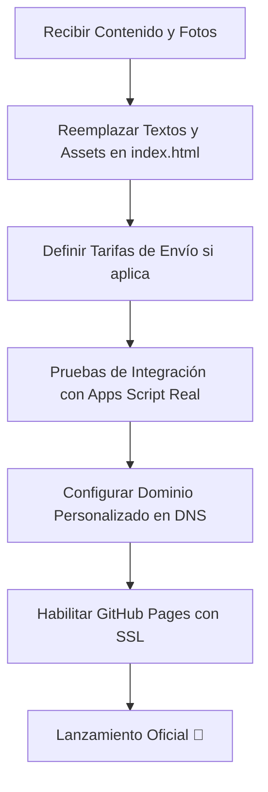

# 📊 INFORME DE AVANCE DE PROYECTO: FRONTEND (DÍA 4)

**Proyecto:** Landing Page Preventa Suplemento "Lynto"  
**Estado General:** 🟢 **Esqueleto Funcional Completado (Listo para Integración)**  
**Tecnologías:** HTML5, Vanilla JavaScript, Tailwind CSS (vía CDN), CSS3 Custom.  
**Arquitectura:** Zero-Trust (Frontend tonto, lógica y cálculos en backend).  

---

## 🔍 Resumen Ejecutivo

Hemos completado el **100% de la lógica core y la maquetación inicial (Mockup)**. El sitio es totalmente funcional de manera local utilizando el **Mock Mode** del backend en Google Apps Script. 

El foco actual del equipo ya no es la codificación del flujo básico, sino la **recopilación de contenidos reales de la marca (clientes)** y la **configuración de la infraestructura productiva** (dominio y pasarela de pago real).

---

## 🟢 1. Hitos Completados (100% Listos)

A diferencia del estado inicial del Día 1, las siguientes tareas de desarrollo ya están completamente programadas, probadas y en la rama `main`:

*   **Estructura HTML5 y Rutas:**
    *   `index.html`: Landing page estructurada con secciones de Hero, características, tabla nutricional interactiva, sección "Acerca de Nosotras", sección de checkout y FAQs.
    *   `exito.html`: Pantalla de confirmación de compra y éxito del pago.
    *   `terminos.html` y `privacidad.html`: Páginas legales básicas con disclaimer médico.
*   **Diseño y UI/UX Premium:**
    *   Estilos globales en `assets/css/style.css` con variables CSS, fuentes de Google Fonts (*Outfit* y *Playfair Display*), animaciones de entrada (`fadeInUp`), y fondos con gradientes y *glassmorphism* oscuros.
*   **Lógica de Negocio y Seguridad (`assets/js/app.js`):**
    *   **Política Zero-Trust:** El JS no calcula precios. Envía únicamente datos personales y cantidad de productos al backend.
    *   **Formateador y Validador de RUT:** Lógica en Vanilla JS que añade puntos y guion automáticamente al escribir, además de validar el dígito verificador chileno (Algoritmo Módulo 11).
    *   **Validaciones de Formulario:** Validación estricta de estructura de correo electrónico y campos requeridos para evitar llamadas innecesarias al servidor.
    *   **Control de Cantidades:** Selector dinámico con restricción local preventiva de máximo 10 unidades por transacción.
    *   **Manejo de Estados (Cargando):** Pantalla de overlay animada bloqueante (`#loading-overlay`) para prevenir que el usuario haga doble clic y envíe múltiples peticiones mientras se procesa la orden.
*   **Entorno de Desarrollo Local:**
    *   Configuración de `package.json` con **Vite** para recarga instantánea en caliente (Hot Reload).
    *   Linter y Formateadores (**ESLint** y **Prettier**) instalados para mantener la consistencia del código entre los 3 desarrolladores.
    *   **Enlace Dinámico de APIs:** Implementación de lectura de endpoint de Apps Script a través de `localStorage` para pruebas independientes.

---

## 🟡 2. Tareas en Desarrollo Activo (Ramas Feature)

*   **Revisión Estética Fina:** Ajuste de márgenes y tamaños para optimización en pantallas móviles extremadamente pequeñas (iPhone SE / pantallas de 320px de ancho).
*   **Preparación de GitFlow:** Coordinación para la apertura de ramas `feature/` específicas una vez que comiencen a llegar los archivos de contenido real de las dueñas de Lynto.

---

## 🔴 3. Bloqueos y Cuellos de Botella (Dependencias del Cliente)

El avance del proyecto hacia la fase de producción está condicionado a la entrega de la información del Checklist de Inicio. A continuación se listan las prioridades pendientes:

### 🎨 A. Identidad Visual y Diseño
*   [ ] **Logotipos:** Archivos oficiales en formato PNG con fondo transparente o SVG (versiones para fondo oscuro).
*   [ ] **Manual de Marca:** Paleta de colores oficial (Hexadecimales) y fuentes si se requiere cambiar las tipografías base actuales (*Outfit* / *Playfair*).
*   [ ] **Fotografías del Producto:** Imágenes de alta resolución del suplemento (render o foto real con fondo transparente para el Hero, y fotos de estilo de vida).

### ✍️ B. Copys y Contenido Escrito
*   [ ] **Textos de la Landing:** Título ("Gancho"), subtítulos y los 3 beneficios clave del suplemento Daily Balance.
*   [ ] **Historia de Fundación:** Texto de la sección "Acerca de Nosotras" (breve reseña de las cofundadoras).
*   [ ] **Ficha Técnica del Suplemento:** Ingredientes exactos, tabla nutricional definitiva, modo de uso y advertencias sanitarias obligatorias en Chile.

### ⚙️ C. Reglas y Logística
*   [ ] **Estructura de Despacho:** Definir si se cobrará un costo de despacho fijo por zonas en el checkout (lo que requerirá agregar un selector de Comunas/Regiones) o si se mantendrá bajo la modalidad "Por Pagar" en el destino.
*   [ ] **Límites de Venta:** Confirmar si el límite máximo por transacción es de 10 unidades.

### ⚖️ D. Legal
*   [ ] **Textos Legales Definitivos:** Políticas de devolución y textos finales para `terminos.html` y `privacidad.html`.

### 🌐 E. Infraestructura
*   [ ] **Acceso a Dominio:** Credenciales o coordinación para configurar los DNS en el proveedor de dominio (ej. NIC Chile) para apuntar a GitHub Pages.
*   [ ] **Acceso a Cuentas:** Acceso temporal a la cuenta corporativa de Google (para Sheets de producción) y llaves API de Flow.cl.

---

## 🗺️ Mapa de Ruta hacia el Lanzamiento (Sprint Restante)

---

*Nota: Este documento debe ser actualizado a medida que las clientas entreguen los recursos de diseño y contenido listados en la sección 3.*
