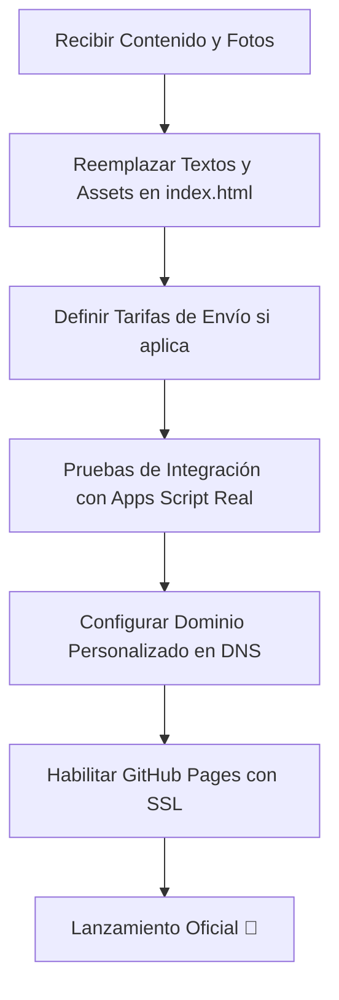

# 📊 INFORME DE AVANCE DE PROYECTO: FRONTEND (DÍA 4)

**Proyecto:** Landing Page Preventa Suplemento "Lynto"  
**Estado General:** 🟢 **Lienzo HTML/CSS Básico y Lógica de Integración Listos**  
**Tecnologías:** HTML5 Semántico, Vanilla JavaScript (ES6+), Vanilla CSS (CSS3) para maquetación a mano.  
**Arquitectura:** Zero-Trust (Frontend tonto, lógica y cálculos en backend).  

---

## 🔍 Resumen Ejecutivo

Hemos reestructurado el frontend para dejar un **esqueleto limpio y simplificado**. Se eliminó la maquetación predefinida con Tailwind CSS para permitir al equipo diseñar y armar la interfaz visual completamente **a mano**. 

Todas las secciones críticas cuentan con marcadores de posición (`[Historia de la marca]`, `[Respuesta]`, `[Rellenar info de despacho]`) listos para ser editados. Se mantiene el **100% de la lógica core y de seguridad en Vanilla JavaScript** conectada al simulador del backend.

---

## 🟢 1. Hitos Completados (100% Listos)

Las siguientes tareas de cimentación y lógica están terminadas y fusionadas en la rama `main`:

*   **Esqueleto HTML5 y Rutas Simplificadas:**
    *   `index.html`: Estructura semántica básica libre de frameworks CSS, con marcadores para Hero, suplemento, tabla nutricional y checkout.
    *   `exito.html`: Pantalla básica de redirección pospago con marcadores de contacto y logística.
    *   `terminos.html` y `privacidad.html`: Estructura para términos legales y de privacidad con desgloses listos para rellenar.
*   **Lógica de Negocio y Seguridad (`assets/js/app.js`):**
    *   **Política Zero-Trust:** El JS envía únicamente datos del cliente y cantidad. Cero lógica de cálculo de precio final local.
    *   **Formateador y Validador de RUT:** Lógica en Vanilla JS que limpia caracteres inválidos, formatea el RUT (ej. `12.345.678-K`) en tiempo real y valida el dígito verificador.
    *   **Validaciones Locales:** Validación de formato de correo y obligatoriedad de campos.
    *   **Overlay de Carga:** Capa bloqueante de pantalla (`#loading-overlay`) para evitar reenvíos múltiples de peticiones.
*   **Entorno de Desarrollo y QA:**
    *   Configuración local con **Vite** para recarga instantánea.
    *   Linter y Formateadores (**ESLint** y **Prettier**) instalados y funcionando para uniformar el código.
    *   **localStorage Overrides:** Habilitado para cambiar la URL del Apps Script desde la consola del navegador.

---

## 🟡 2. Tareas en Desarrollo Activo (Foco del Equipo Frontend)

Dado el cambio hacia maquetación manual, el equipo frontend tiene como tareas prioritarias:

*   **Maquetación y Diseño CSS:** Escribir las hojas de estilo personalizadas en `assets/css/style.css` a partir del esqueleto actual.
*   **Reemplazo de Placeholders:** Llenar las secciones una vez que las clientas entreguen los copys oficiales.
*   **Definición Visual de Carga:** Diseñar la animación del spinner en la pantalla de carga (`#loading-overlay`) según el estilo gráfico elegido.

---

## 🔴 3. Bloqueos y Cuellos de Botella (Dependencias del Cliente)

El avance final del proyecto está condicionado a la entrega de la información del Checklist de Inicio:

### 🎨 A. Identidad Visual y Diseño
*   [ ] **Logotipos:** Archivos en PNG transparente o SVG.
*   [ ] **Paleta de Colores y Tipografías:** Códigos hexadecimales y archivos/enlaces de fuentes tipográficas para incorporar en el CSS.
*   [ ] **Imágenes del Suplemento:** Fotografías en alta resolución y lifestyle.

### ✍️ B. Copys y Contenido Escrito
*   [ ] **Contenido de la Landing:** Textos oficiales del Hero, beneficios y la historia de fundación ("Acerca de Nosotras").
*   [ ] **Ficha Técnica:** Listado de ingredientes oficiales y valores finales para la tabla nutricional.
*   [ ] **FAQs:** Respuestas definitivas para las preguntas frecuentes de preventa.

### ⚙️ C. Reglas y Logística
*   [ ] **Estructura de Envío:** Definir costos de despacho por comunas o si se mantendrá bajo modalidad "Por Pagar" (para reflejarlo en el checkout).
*   [ ] **Límites de Venta:** Confirmar límite máximo de unidades de preventa por cliente.

### ⚖️ D. Legal y Credenciales
*   [ ] **Textos Legales:** Políticas de reembolso y términos legales finales.
*   [ ] **Acceso a Dominio y Pasarela:** Datos de NIC Chile para DNS y credenciales Flow.cl.

---

## 🗺️ Mapa de Ruta hacia el Lanzamiento (Sprint Restante)

---

*Nota: Este documento debe ser actualizado a medida que las clientas entreguen los recursos de diseño y contenido listados en la sección 3.*
