# 📊 INFORME DE AVANCE DE PROYECTO: FRONTEND Y BACKEND

**Proyecto:** Landing Page Preventa Suplemento "Lynto"  
**Estado General:** 🟢 **Lógica Core Lista | Acceso a Sheets y Flow Desbloqueados**  
**Plazo:** Estricto de 8 días (Lanzamiento programado para Agosto de 2026)  
**Última Actualización:** 19 de Julio de 2026. Tenemos hasta el 25

---

## 🔍 Resumen Ejecutivo

El proyecto ha avanzado a la fase de **Integración Real**. Los accesos a la planilla corporativa de Google Sheets y las llaves API de Flow.cl están en proceso de recepción/configuración. 

El foco técnico se centra en:
1.  **Tech Lead:** Estructurar la hoja maestra de autogestión en Google Sheets (Sheets `"Inventario"`, `"Pedidos"`, `"Configuracion"` y `"Nutricion"`).
2.  **Backend:** Finalizar la API `get_config` para servir los datos dinámicos al front.
3.  **Frontend:** Diseñar la maquetación CSS a mano e implementar la inyección dinámica de contenidos desde Sheets.

Los únicos bloqueos pendientes por parte de las clientas corresponden a **decisiones de negocio de checkout**, **activos de marca** y **credenciales de dominio**.

---

## ⚙️ Especificación Técnica: Personalización Dinámica desde Google Sheets

Las clientas modificarán la página web directamente desde su Google Sheet corporativo sin tocar código (textos, precios, tabla nutricional, disclaimer y fotos). El flujo transaccional se compone de dos fases:

```mermaid
sequenceDiagram
    rect rgb(13, 18, 30)
        note right of Frontend: Fase 1: Carga Dinámica desde Google Sheets
        Frontend->>Backend: GET /exec?action=get_config (Carga de Página)
        Backend->>Google Sheets: Lee pestañas "Configuracion" y "Nutricion"
        Google Sheets-->>Backend: Retorna valores de celdas
        Backend-->>Frontend: Retorna JSON (textos, fotos, límites y tabla)
        Frontend->>Frontend: Inyecta en el DOM (reemplaza placeholders)
    end
    
    rect rgb(7, 9, 14)
        note right of Frontend: Fase 2: Checkout Transaccional
        Frontend->>Backend: POST /exec (Intención de compra - Zero Trust)
        Backend->>Backend: Valida RUT, Email, Cantidad, Cupón y Tarifa Envío en BD
        Backend->>Backend: Firma petición (HMAC-SHA256) y llama a Flow API Real
        Backend-->>Frontend: Retorna URL de redirección a Flow.cl
        Frontend->>Flow: Redirige al cliente a pagar (Webpay/Mach)
        Flow-->>Backend: Webhook S2S (Confirmación de Pago)
        Backend->>Backend: Bloquea BD (LockService), cambia estado a PAGADO y reduce stock
    end
```

---

## 🧑‍💻 Desglose de Tareas por Rol y Desarrollador

### 1. Backend 1: Tech Lead (DevOps, QA, BD y API Flow) 
**Misión:** Infraestructura, control de calidad, base de datos maestra y pasarela de pagos.

*   **🟢 Completado:**
    *   Configuración inicial de repositorios desacoplados (`Lynto-frontend` y `Lynto-backend`).
    *   Arquitectura Zero-Trust y seguridad criptográfica HMAC-SHA256 para Flow.
    *   Esqueleto HTML/CSS básico y validadores en frontend.
*   **🟡 En Progreso:**
    *   **Configuración Flow Producción:** Reemplazar llaves de Sandbox por llaves de producción (`FLOW_API_KEY`, `FLOW_SECRET_KEY`) en Script Properties.
*   **🔴 Pendiente (Bloqueado por Cliente):**
    *   **Vincular Dominio:** Configurar los registros DNS en **NIC Chile** hacia GitHub Pages y habilitar el certificado SSL. *Bloqueado por credenciales de NIC Chile.*
    *   **Documentación Técnica Fase 2:** Redactar manuales de uso del Sheets y arquitectura de traspaso.
    *   **QA & Code Review:** Aprobar los PRs asegurando `LockService` y confirmación S2S.

---

### 2. Backend 2: (Lógica Core y Concurrencia)
**Misión:** Motor transaccional, API de configuración y gestión de estado.

*   **🟢 Completado:**
    *   Endpoints `doPost` y `doGet` simulados con respuesta JSON.
    *   Protección contra sobreventas mediante `LockService.getScriptLock()`.
    *   Validaciones de servidor de RUT, Email y Stock.
*  **🔴 Desarrollar (Lógica Pendiente):** 
    *   **Creación de Hoja Maestra:** Diseñar la estructura de las pestañas en el Google Sheet oficial:
        * `"Inventario"` (SKU, Nombre, Precio, Stock).
        *   `"Pedidos"` (ID, Fecha, Nombre, RUT, Email, Dirección, Cantidad, Monto, Estado, FlowOrder ID).
        *   `"Configuracion"` (Pares Clave/Valor para textos del Home, fotos, límites de compra, disclaimer legal).
        *   `"Nutricion"` (Componente, Cantidad por porción, % DDR).
        *   `"TarifasEnvio"` / `"Cupones"` (Si las clientas deciden activarlos).
    *   **API `get_config`:** Implementar en `doGet.js` la lectura de las pestañas `"Configuracion"` y `"Nutricion"` y retornar el JSON estructurado para el front.
    *   **Lógica de Envíos y Cupones (Si se aprueban):** Si las clientas eligen selector de envío o cupones de descuento, sumar costo de envío y aplicar porcentaje de descuento al `montoTotal` en `procesarIntencionCompra`.

---

### 3. Especialista Frontend
**Misión:** Maquetación CSS manual, renderizado dinámico e interfaz de conversión.

*   **🟢 Completado:**
    *   Esqueleto HTML5 semántico (`index.html`, `exito.html`, `terminos.html`, `privacidad.html`).
    *   Validación y formateador de RUT chileno en vivo (Módulo 11) y correo.
    *   Controlador de cantidad e inhabilitador de doble clic (`#loading-overlay`).
*   **🔴 Desarrollar (Lógica Pendiente):**
    *   **Inyección Dinámica:** Implementar el `fetch` GET a `API_URL?action=get_config` al cargar la página para inyectar los textos, fotos, disclaimer y filas de la tabla nutricional.
    *   **Casilla de Cupones / Selector de Envíos:** Si se aprueban, agregar el input de código promocional o el desplegable de regiones en el formulario de checkout.
    *   **Maquetación CSS a Mano:** Escribir los estilos visuales finales en `assets/css/style.css`.

---

## 🔴 4. Decisiones y Bloqueos Pendientes del Cliente

Tomando como base el informe oficial entregado a las clientas, los elementos pendientes por su parte son:

### ⚙️ 1. Reglas de Negocio (Checkout y Pagos)
*   [ ] **Estructura de Despacho:** Definir si se agregará un selector de regiones con tarifa fija (ej. RM $3.500 / Regiones $5.000) o si se mantendrá bajo la modalidad **"Por Pagar"** al recibir.
*   [ ] **Cupones de Descuento:** Definir si se realizarán campañas con códigos promocionales (ej. `"PREVENTA20"`) para programar la casilla de descuento en el carrito.

### 🎨 2. Activos de Diseño y Multimedia
*   [ ] **Identidad Visual:** Logotipos en alta calidad (PNG sin fondo o SVG), paleta de colores corporativa y tipografías oficiales.
*   [ ] **Fotografías del Producto:** Imágenes en alta resolución (fondo transparente y uso real/lifestyle).

### 🌐 3. Dominio Oficial (Despliegue)
*   [ ] **Credenciales de NIC Chile:** Usuario y contraseña para la vinculación del dominio oficial y la generación del certificado de seguridad HTTPS (SSL).

---

*Nota: Este documento debe ser actualizado a medida que las clientas entreguen los accesos a NIC Chile y definan las reglas de envío/cupones.*
